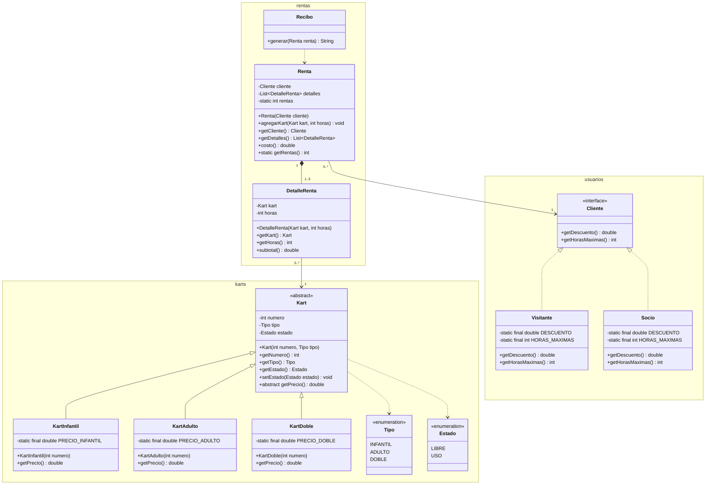

# Diagrama

```mermaid
classDiagram
    namespace karts {
        class Kart {
            <<abstract>>
            -int numero
            -Tipo tipo
            -Estado estado
            +Kart(int numero, Tipo tipo)
            +getNumero() int
            +getTipo() Tipo
            +getEstado() Estado
            +setEstado(Estado estado) void
            +abstract getPrecio() double
        }
        class KartInfantil {
            -static final double PRECIO_INFANTIL
            +KartInfantil(int numero)
            +getPrecio() double
        }
        class KartAdulto {
            -static final double PRECIO_ADULTO
            +KartAdulto(int numero)
            +getPrecio() double
        }
        class KartDoble {
            -static final double PRECIO_DOBLE
            +KartDoble(int numero)
            +getPrecio() double
        }
        class Tipo {
            <<enumeration>>
            INFANTIL
            ADULTO
            DOBLE
        }
        class Estado {
            <<enumeration>>
            LIBRE
            USO
        }
    }
    namespace usuarios {
        class Cliente {
            <<interface>>
            +getDescuento() double
            +getHorasMaximas() int
        }
        class Visitante {
            -static final double DESCUENTO
            -static final int HORAS_MAXIMAS
            +getDescuento() double
            +getHorasMaximas() int
        }
        class Socio {
            -static final double DESCUENTO
            -static final int HORAS_MAXIMAS
            +getDescuento() double
            +getHorasMaximas() int
        }
    }
    namespace rentas {
        class DetalleRenta {
            -Kart kart
            -int horas
            +DetalleRenta(Kart kart, int horas)
            +getKart() Kart
            +getHoras() int
            +subtotal() double
        }
        class Renta {
            -Cliente cliente
            -List~DetalleRenta~ detalles
            -static int rentas
            +Renta(Cliente cliente)
            +agregarKart(Kart kart, int horas) void
            +getCliente() Cliente
            +getDetalles() List~DetalleRenta~
            +costo() double
            +static getRentas() int
        }
        class Recibo {
            +generar(Renta renta) String
        }
    }
    Kart <|-- KartInfantil
    Kart <|-- KartAdulto
    Kart <|-- KartDoble
    Cliente <|.. Visitante
    Cliente <|.. Socio
    Renta "1" *-- "1..3" DetalleRenta
    DetalleRenta "0..*" --> "1" Kart
    Renta "0..*" --> "1" Cliente
    Recibo ..> Renta
    Kart ..> Tipo
    Kart ..> Estado
```
